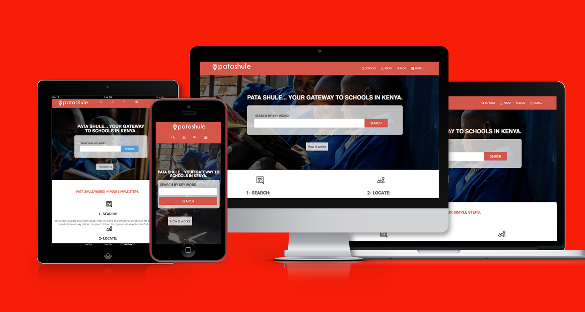

# Eventify HTML Capstone

> This is my HTML/CSS capstone project at Microverse.
> It is an event page around Europe and it contains 3 pages.
> Home page, Search page, and Event page.

<br><br>

> I was given this design of [Mathew Njuguna](https://www.behance.net/gallery/25563385/PatashuleKE)'s to follow, mirroring its structure, typography and colors as > I built my own event website.

I used event pictures, and event details from [Biletix](https://www.biletix.com/anasayfa/TURKIYE/tr)'s site.

## Video Presentation

Here is my [video presentation](https://www.loom.com/share/da5fc6eea64c42c992382a22095b022f) for this project.


## Built With

- HTML-CSS
- Bootstrap (downloaded as npm package)
- node-sass (downloaded as npm package)
- Netlify
- Font Awesome
- Autoprefixer

## Live Demo

[Live Demo Link](https://elated-thompson-d36982.netlify.app/)

## Getting Started

**To get this project set up on your local machine, follow these simple steps:**

1. Open Terminal.

2. Navigate to your desired location to download the contents of this repository.

3. Copy and paste the following code into the Terminal:
```
git clone https://github.com/eypsrcnuygr/HTML-Capstone.git
```
or with SSH:

```
git clone git@github.com:eypsrcnuygr/HTML-Capstone.git
```

4. Hit enter.

5. Once the repository has been cloned, open index.html in a browser of your choosing. From there, you may also navigate to the "Search" and "Event" pages.

6. Enjoy

## Prerequisities

- A computer, a smartphone, or another similar device.
- Access to the internet.

## Authors

👤 **Eyüp Sercan UYGUR**

- Github: [@eypsrcnuygr](https://github.com/eypsrcnuygr)
- Twitter: [@eypsrcnuygr](https://twitter.com/eypsrcnuygr)
- Linkedin: [eypsrcnuygr](https://www.linkedin.com/in/eypsrcnuygr/)
- E-mail: [sercanuygur@gmail.com](sercanuygur@gmail.com)

## 🤝 Contributing

Contributions, issues and feature requests are welcome!

Feel free to check the [issues page](https://github.com/eypsrcnuygr/HTML-Capstone/issues).

## Show your support

Give a ⭐️ if you like this project!

## Acknowledgments

- Thanks are owed to the designer, [Mathew Njuguna](https://www.behance.net/gallery/25563385/PatashuleKE), for his design.
- Logo has been made from [Small Seo Tools](https://smallseotools.com/)'s site.
- The index page's pictures are taken from [unsplash](https://unsplash.com/).
- Cem Yılmaz is an popular comedian in Turkey. Check him.

## 📝 License

This project is [MIT](lic.url) licensed.
